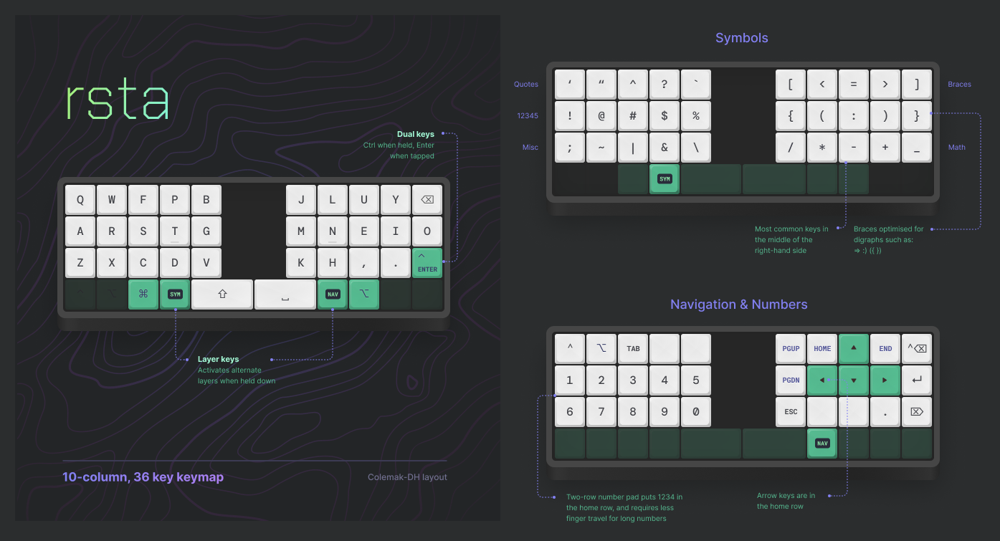

<h1 align='center'>Rico's keymap</h1>

My (<a href='https://twitter.com/rstacruz'>@rstacruz</a>) personal keymaps for the <a href='https://qmk.fm/'>QMK firmware</a> for mechanical keyboards.

👉 Steal this <a href='qmk-base36/keymap.c'><strong>keymap.c</strong></a> 👉

## Rationale

- **30% layout with 5 columns per side.** This puts all keys within one key distance from the home row, and minimises pinky movements which often involve wrist movements too. Your hands are meant to be stationary when using this layout.

- **Minimise the use of tap-hold keys.** Most 30% keymaps rely on tap-hold keys, but these keys only emit on key up, not key down, leading to a feel of latency. This keymap avoids it except for one key.

- **No home row mods.** [Home row mods](https://precondition.github.io/home-row-mods) are a popular option, but they come at the cost of tap-hold keys, and a risk of possibly making typing mistakes with them.

- **All symbols in one layer.** The symbols layer is optimised for programming work to prevent 'shift-dancing' around keys.

- **One-handed numpad with two rows.** A two-row number pad is easier to type on with less vertical movements. Having them in the same layer as arrow keys also help in Vim navigation.

[home row mods]: https://precondition.github.io/home-row-mods

## One-hand mode

Pressing <kbd>Sym</kbd>+<kbd>Shift</kbd> (in that order) will enable an experimental [one-handed mode](./docs/frogv.md).

## Contents

- [**qmk-base36/**](./qmk-base36/) &mdash; QMK keymap for an OLKB planck keyboard
- [**kmonad/**](./kmonad/) &mdash; Keymaps for kmonad for laptop keyboards
