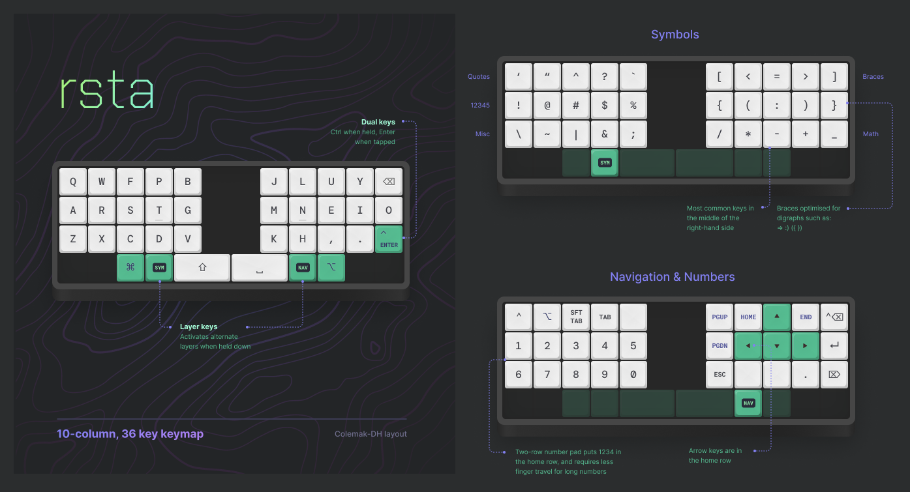

<h1 align='center'>rsta keymap</h1>

My personal keymaps for the <a href='https://qmk.fm/'>QMK firmware</a> for mechanical keyboards.

## Rationale

- 30% layout with 5 columns per side
- No home row mods
- Minimise the use of tap-hold keys
- All symbols in one layer

[home row mods]: https://precondition.github.io/home-row-mods

## Contents

- [**qmk-planck/**](./qmk-planck/) &mdash; QMK keymap for an OLKB planck keyboard
- [**kmonad/**](./kmonad/) &mdash; Keymaps for kmonad for laptop keyboards
